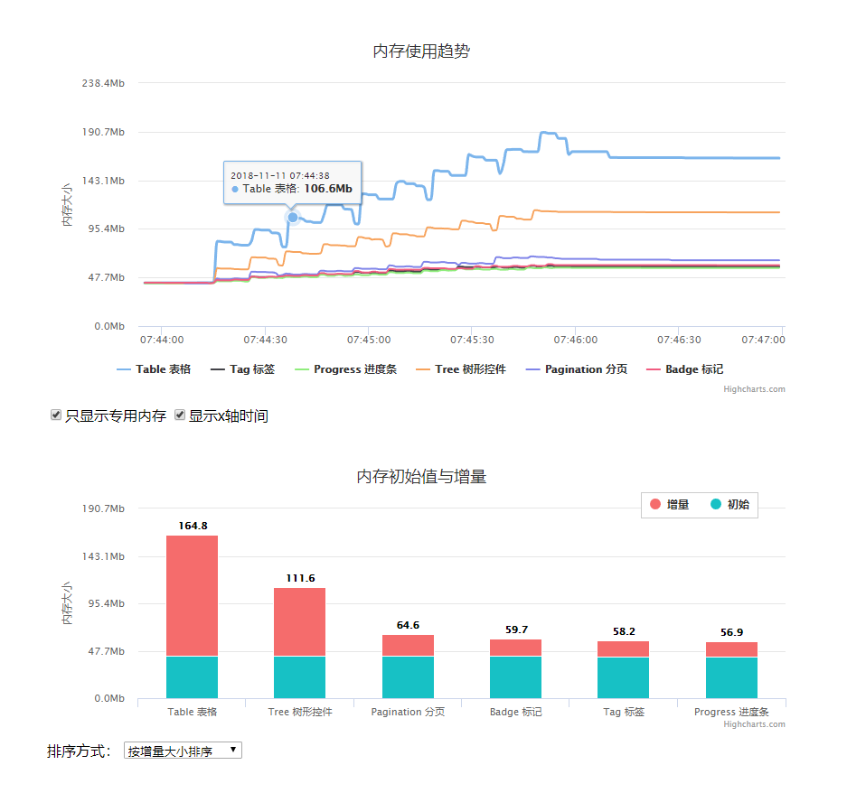

# wapp process test

通过编写任务yml文件，执行一系列串行、循环、或并行的任务，可用于浏览器自动测试，记录浏览器进程资源占用，生成资源占用趋势图、以及资源占用增量图。一个实际的使用场景是，通过反复的操作，测试单页应用页面、或组件是否存在内存泄漏。从而选取内存泄露严重的页面，优先处理。

## 命令运行
1. 安装必要的python包
2. 安装相应版本的chromedriver（如果进行浏览器测试）
3. 编写对应的setting.yml文件，运行`python main.py -f ./test-single-page/setting.py`
4. 查看setting.yml目录下生成的js、json数据文件（如果进行浏览器测试，且配置了`process_logger`）

注意，当前存在一些限制尚待完善，当前是能正常运行的工具：
* 只支持chrome，且只有chrome 68支持自动获取进程id，其他版本可能获取到错误的进程id。同时注意，chrome默认一个域名对应一下标签页进程。
* 只支持内置的任务操作，除自定义js、py脚本外，暂不支持自定义的任务类型
* 支持多线程执行任务，未限制线程数量，另外在多个任务修改任务配置可能导致错误
* 内置的操作待扩充
* 发布为python包
* 从log-memory移入图表生成相关文件

## 配置文件

一个任务可以包含子任务，所有任务的结构相同，可以互相包含。`pre`配置的任务在`task`任务前执行，可以通过`pre`配置，编写脚本文件构建任务配置。

配置文件示例，`test-eleme-page/setting.yml`
```yaml
    
# 单页面，来回切换页面与空页面（内容区域为空），记录每个页面的内存使用趋势与内存增量

global:
  root: '' # setting.yml所在路径，自动填充

  #login_page: &LOGIN_PAGE 'https://element-cn.eleme.io/login'
  empty_page: &EMPTY_PAGE 'http://element-cn.eleme.io/#/zh-CN/resource' # 假定该页为内容区域空白页
  component_page: &COMPONENT_PAGE 'http://element-cn.eleme.io/#/zh-CN/component/installation'

#  login: &LOGIN
#    name: 'login'
#    run:
#      times: 1
#    task:
#      -
#        opr: 'navigate_to'
#        url: *LOGIN_PAGE
#      -
#        opr: 'sleep'
#        time: 3
#      -
#        opr: 'js_script'
#        src: 'js/login.js'

  task_config: &TASK_CONFIG
    name: '__task_name__' # 给任务起个名字
    run:
      times: 10           # 执行下面的task任务，切换页面10次
    driver: &DRIVER
      default_url: *EMPTY_PAGE
    task:
#      -
#        *LOGIN # 如果需要先登录才能访问，添加*LOGIN任务项
#      -
#        opr: 'sleep'
#        time: 5
      -
        run:
          times: 1
        opr: 'sleep'
        time: 30
      -
        opr: 'navigate_to'
        url: '__task_url__' # 需要测试的页面url
      -
        opr: 'sleep'
        time: 5
      -
        opr: 'navigate_to'
        url: *EMPTY_PAGE
      -
        opr: 'sleep'
        time: 5

pre:
  name: 'process task config'
  driver:
    default_url: *COMPONENT_PAGE
  logger:
    debug: True
  task:
#    -
#      *LOGIN
#    -
#      opr: 'sleep'
#      time: 3
#    -
#      opr: 'navigate_to'
#      url: *EMPTY_PAGE
    -
      opr: 'sleep'
      time: 5
    -
      opr: 'py_script'
      src: 'py.process_task_setting'

task:
  -
    name: 'test-eleme-page'
    run:
      type: 'parallel'      # 并行测试页面
    logger: &LOGGER
      debug: True
    process_logger: &PROCESS_LOGGER
      debug: True
      interval: 1
      start_interval: 10
      end_interval: 60
    task:
      # 使用py/process_task_setting.py 构造task

```

## 统计数据
统计数据示例，`test-eleme-page/setting.yml`，将配置文件所在位置process_logger目录下生成的`data.js`拷贝到`view/data`目录，查看`view/index.html`文件。效果如下：



由上图可以看出，同一个页面经过多次切换后，内存成持续增长的趋势。如果存在内存问题，则可根据增长量选择选择处理的页面，使用devtool进行更详细的定位。

需要注意，切换页面内存并不一定全部即刻回收，但是增长趋势能说明一定的问题。